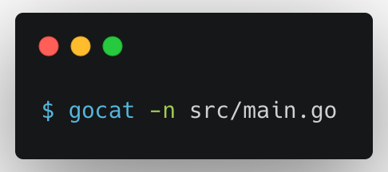

# gocat
Unix cat implementation in Go

## Usage

The following command will print the contents of `src/main.go` with line number to the standard output.

<p align="center">
    
</p>

## Manual

A small HelpDoc for [gocat](https://github.com/tuladhar/gocat):
```
Usage: 
    gocat FILE
    
Description:
    Print FILE to Standard Output
```

## Demo
Here's the sample usage as a GIF:

<p align="center">
    
</p>
